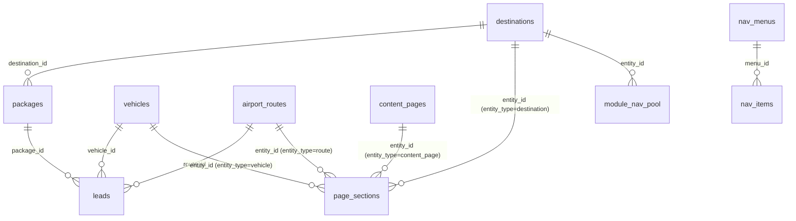

# Divine Travel — Architecture V3

> **Status:** Frozen. Do not redesign without explicit approval. See [PROJECT_RULES.md](./PROJECT_RULES.md).

## Table of Contents

1. [Project Vision](#1-project-vision)
2. [Technology Stack](#2-technology-stack)
3. [Architecture Principles](#3-architecture-principles)
4. [Module Overview](#4-module-overview)
5. [Database Architecture](#5-database-architecture)
6. [Navigation Architecture](#6-navigation-architecture)
7. [Section-Based Page Builder](#7-section-based-page-builder)
8. [Universal Enquiry Engine](#8-universal-enquiry-engine)
9. [SEO Architecture](#9-seo-architecture)
10. [Lead Management](#10-lead-management)
11. [Authentication & RBAC](#11-authentication--rbac)
12. [Activity Logging](#12-activity-logging)
13. [Seed Data Strategy](#13-seed-data-strategy)
14. [Enterprise Standards](#14-enterprise-standards)
15. [Sprint Roadmap](#15-sprint-roadmap)
16. [Future Scalability](#16-future-scalability)
17. [Version History](#17-version-history)

---

## 1. Project Vision

Divine Travel is a production-grade travel company CMS and website for a South India-based operator specialising in pilgrimage, leisure, corporate, and vehicle rental services.

The platform must:
- Look like a live, trusted business on first deployment (seed data included)
- Allow non-technical staff to manage all content through an admin panel
- Support progressively richer pages via a section-based page builder without breaking existing routes
- Capture every visitor inquiry as a structured lead
- Maintain excellent SEO across all public pages
- Be fully deployable on Netlify with zero backend infrastructure beyond Supabase

---

## 2. Technology Stack

| Layer | Choice | Reason |
|---|---|---|
| Framework | Next.js 13.5.1 (App Router) | Server Components, metadata API, nested layouts |
| Database | Supabase (PostgreSQL) | RLS, real-time, Auth, Storage, SSR-compatible |
| Styling | Tailwind CSS 3.3 | Utility-first, design token support |
| UI Components | shadcn/ui + Radix UI | Accessible, headless, no external dependency |
| Icons | lucide-react | Tree-shakable, consistent |
| Forms | react-hook-form + zod | Type-safe validation |
| Auth | Supabase Auth (email/password) | Session-aware SSR via @supabase/ssr |
| Deployment | Netlify + @netlify/plugin-nextjs | Zero-config serverless Next.js |
| Analytics | GTM + GA4 + Meta Pixel | Configurable via admin without redeploy |

---

## 3. Architecture Principles

### Progressive Enhancement
Module pages ship with a hardcoded fallback layout. When CMS sections are configured, they replace the fallback — no migration, no breakage.

### Separation of Client and Server
- `lib/supabase/server.ts` exports three distinct clients:
  - `createPublicClient()` — anon key, no cookies, safe for `generateMetadata` and static paths
  - `createServerClient()` — SSR session client, requires live request context
  - `createAdminClient()` — service-role key, bypasses RLS, only for trusted API routes
- `lib/sections/meta.ts` holds client-safe section metadata (no server imports)
- `lib/sections/registry.ts` holds server-only fetch functions and re-exports from meta

### API Routes as the Admin Boundary
All admin mutations go through `/api/admin/*` route handlers which call `requireAdminApi()`. This pattern gives consistent auth checking, activity logging, and Zod validation in one place.

### RLS Everywhere
Every table has Row Level Security enabled. Public reads use anon-key policies. Admin writes use service-role bypasses exclusively in route handlers, never in client code.

---

## 4. Module Overview

```
app/
├── (public)/                    # All public-facing pages
│   ├── page.tsx                 # Homepage (section-based via HomepageBuilder)
│   ├── [slug]/page.tsx          # Dynamic CMS content pages (/about-us, /contact-us…)
│   ├── divine-tours/[slug]/     # Divine (pilgrimage) destination detail
│   ├── domestic-tours/[slug]/   # Domestic destination detail
│   ├── international-tours/[slug]/  # International destination detail
│   ├── packages/[slug]/         # Individual tour package detail
│   ├── vehicle-rentals/[slug]/  # Vehicle detail
│   ├── airport-transfers/[slug]/# Airport route detail
│   ├── blog/[slug]/             # Blog post detail
│   ├── contact/                 # Contact form page
│   ├── hotel-assistance/        # Hotel booking assistance form
│   ├── gallery/                 # Photo gallery
│   ├── faq/                     # FAQ page
│   └── testimonials/            # Testimonials listing
│
├── admin/
│   ├── (auth)/login/            # Admin login
│   └── (protected)/             # All protected admin pages
│       ├── page.tsx             # Dashboard
│       ├── content-pages/       # Section-based content page manager + builder
│       ├── homepage-builder/    # Homepage section manager
│       ├── destinations/        # Destination CRUD
│       ├── packages/            # Package CRUD
│       ├── vehicles/            # Vehicle CRUD
│       ├── airport-routes/      # Route CRUD
│       ├── blog/                # Blog CRUD
│       ├── testimonials/        # Testimonial CRUD
│       ├── leads/               # Lead management (kanban + table)
│       ├── menus/               # Navigation menu editor
│       ├── categories/          # Package categories
│       ├── media/               # Media library
│       ├── seo-pages/           # Per-path SEO overrides
│       ├── site-settings/       # Analytics, OG defaults
│       ├── theme/               # Brand colours, contact details
│       ├── cms-pages/           # Legacy CMS pages (being superseded)
│       ├── activity/            # Activity audit log
│       └── …
│
└── api/admin/                   # REST endpoints for all admin mutations
```

---

## 5. Database Architecture

### Core Tables



### Table Reference

| Table | Purpose | Key Columns |
|---|---|---|
| `destinations` | Tour destinations (divine / domestic / international) | `slug`, `region`, `is_published` |
| `packages` | Tour packages | `slug`, `destination_id`, `tour_type`, `starting_price` |
| `vehicles` | Rental vehicles | `slug`, `seats`, `luggage_capacity` (int), `features` (text[]) |
| `vehicle_categories` | Vehicle groupings (Sedan, SUV, Tempo) | `slug`, `display_order` |
| `airport_routes` | Transfer routes | `slug`, `from_city`, `to_city`, `vehicles` (jsonb) |
| `blogs` | Blog posts | `slug`, `tags` (text[]), `is_published` |
| `testimonials` | Customer reviews | `rating`, `is_published` |
| `leads` | Enquiry submissions | `status`, `source`, `priority`, `utm_*` |
| `content_pages` | Section-managed pages | `slug`, `page_type`, `entity_type`, `entity_id` |
| `page_sections` | Polymorphic page sections | `entity_type`, `entity_id`, `section_type`, `config` (jsonb) |
| `module_nav_pool` | Auto-synced nav items per module | `module`, `entity_type`, `entity_id` |
| `nav_menus` | Top-level navigation groups | `title`, `display_order` |
| `nav_items` | Links within nav groups | `menu_id`, `pool_entity_id` |
| `homepage_sections` | Homepage layout sections | `section_key`, `is_enabled`, `config` |
| `seo_pages` | Per-path SEO overrides | `path`, `seo_title`, `robots_index` |
| `theme_settings` | Brand colours, contact info | `primary_color`, `whatsapp_number` |
| `site_settings` | Analytics IDs, OG defaults | `gtm_id`, `ga4_id`, `site_url` |
| `media_assets` | Uploaded media files | `url`, `mime_type`, `entity_type` |
| `activity_logs` | Admin audit trail | `action`, `entity`, `user_email` |
| `faqs` / `faq_categories` | FAQ content | `question`, `answer`, `display_order` |
| `gallery_items` | Photo gallery | `image_url`, `category` |
| `enquiry_form_configs` | Dynamic form definitions | `form_key`, `fields` (jsonb) |

### Important Column Type Notes

- `vehicles.luggage_capacity` — `integer` (number of bags, not text)
- `packages.highlights`, `inclusions`, `exclusions`, `destinations` — `text[]` (Postgres array syntax `'{"item1","item2"}'`)
- `packages.itinerary`, `packages.pricing`, `packages.faqs` — `jsonb`
- `airport_routes.vehicles` — `jsonb` array of `{vehicle_type, seats, price}`
- `blogs.tags` — `text[]`
- `vehicles.features` — `text[]`

### Migrations

| File | Description |
|---|---|
| `0001_divine_travel_schema.sql` | Full platform schema (all tables, RLS, triggers) |
| `0002_fix_page_sections_polymorphic.sql` | Renamed `page_id` → `entity_id`, added `entity_type`, `label` |
| `0003_seed_content_pages.sql` | 4 content pages (About, Contact, Corporate, Group) with 24 sections |
| `0004_seed_demo_data.sql` | 3 vehicle categories, 8 destinations, 6 packages, 4 vehicles, 3 routes, 6 testimonials, 3 blogs, 11 nav pool entries |

---

## 6. Navigation Architecture

### Two-Layer System

```
Layer 1: Curated Nav (nav_menus + nav_items)
  — Admin configures menus manually
  — nav_items can reference pool entries via pool_entity_id
  — Rendered by header component

Layer 2: Module Nav Pool (module_nav_pool)
  — Auto-populated when entities are created/updated/deleted
  — One entry per entity (upserted on conflict entity_type + entity_id)
  — Available for mega-menus, category pages, and data-driven nav
```

### Pool Auto-Sync

Whenever a destination, vehicle category, or airport route is created/updated via the admin API, `upsertNavPool()` is called to keep the pool current. Deletes call `removeNavPool()`.

```typescript
// lib/nav/pool.ts
upsertNavPool({ module, entity_type, entity_id, label, url, cover_image, badge_text, is_published })
removeNavPool(entity_type, entity_id)
```

### Fetch Helpers

```typescript
// lib/nav/fetch.ts
fetchNavMenus()        // Curated menus with items
fetchNavPool(module?)  // Pool items (optionally filtered by module)
fetchNavWithPool()     // Both in one parallel call
```

---

## 7. Section-Based Page Builder

### Overview

The page builder allows admin users to compose pages from pre-built section components without writing code.

### Architecture

```
content_pages (or any entity)
    └── page_sections (polymorphic via entity_type + entity_id)
            └── section_type → mapped to React component
            └── config (jsonb) → passed as props
            └── is_enabled → controls visibility
            └── display_order → drag/keyboard reorder
```

### Polymorphic entity_type values

| entity_type | Description |
|---|---|
| `content_page` | Standalone CMS pages (About, Contact, etc.) |
| `destination` | Destination detail pages |
| `vehicle` | Vehicle detail pages |
| `vehicle_category` | Vehicle category landing pages |
| `package` | Package detail pages |
| `route` | Airport transfer route pages |
| `blog` | Blog post detail pages |
| `global` | Shared sections across pages |

### 22 Section Components

| Group | Sections |
|---|---|
| Layout & Content | `hero_banner`, `rich_text`, `image_text_split`, `image_gallery`, `image_banner`, `video_section`, `timeline` |
| Data Sections | `package_grid`, `destination_grid`, `vehicle_grid`, `transfer_grid`, `blog_grid`, `testimonials` |
| Engagement | `faq`, `feature_cards`, `statistics`, `pricing_cards` |
| Conversion | `enquiry_form`, `cta_banner`, `whatsapp_cta`, `google_map` |
| Advanced | `html_block` |

### PageRenderer Pattern

Module detail pages use the `PageRenderer` server component with a fallback:

```tsx
<PageRenderer
  entityType="destination"
  entityId={dest.id}
  fallback={<>...legacy JSX...</>}
/>
```

If no sections exist in the database for the entity, the fallback renders. When sections are added via the builder, they replace the fallback. This ensures zero breaking changes during migration.

### Templates

`lib/sections/templates.ts` defines 9 pre-built templates:

| Template | Use case |
|---|---|
| `blank` | Empty canvas |
| `tour-landing` | Destination/tour landing with packages |
| `destination-page` | Destination with gallery and enquiry |
| `vehicle-page` | Vehicle detail with pricing |
| `transfer-route` | Airport route with pricing table |
| `about-us` | Company about page |
| `contact-page` | Contact with form and map |
| `general` | Simple hero + rich text + CTA |
| `corporate` | Corporate travel landing |
| `group-tour` | Group tour landing |

### Client/Server Boundary

- `lib/sections/meta.ts` — client-safe (section labels, groups, icons)
- `lib/sections/registry.ts` — server-only (fetch functions) + re-exports from meta
- `components/admin/page-builder-client.tsx` — imports from `meta.ts` only

---

## 8. Universal Enquiry Engine

All enquiry forms on the site submit to `POST /api/leads`. Each submission creates a `LeadRow` with:

- Structured contact fields (name, mobile, email, destination, travel date, adults, children)
- Source tracking (`source`, `module_source`, `form_key`, `package_id`, `vehicle_id`, `route_id`)
- UTM attribution (`utm_source`, `utm_medium`, `utm_campaign`, `utm_term`, `utm_content`, `landing_page`)
- Hotel-specific data in `hotel_data` jsonb field
- Free-form extra data in `extra_data` jsonb field
- Default `status: 'new'`, configurable `priority`

Form configurations are stored in `enquiry_form_configs` allowing admin-defined fields, success messages, and lead priority per form key.

---

## 9. SEO Architecture

### Three-Level Override System

```
Level 1: Entity defaults (package.seo_title, destination.seo_description, etc.)
Level 2: seo_pages table override (per-path, set by admin)
Level 3: Computed fallback (brand name + entity name pattern)
```

### Implementation

`lib/seo/metadata.ts` exports:
- `buildMetadata(args)` — constructs Next.js `Metadata` object with full OG/Twitter support
- `fetchSeoContext(path)` — parallel fetch of theme, site settings, and per-path SEO override

Every public page calls `fetchSeoContext` and passes the result to `buildMetadata`.

### Other SEO Features

- `app/sitemap.ts` — dynamic sitemap from all published entities
- `app/robots.ts` — configurable robots.txt
- `components/layout/json-ld.tsx` — structured data support
- Canonical URL support at entity level and via seo_pages override
- OpenGraph images with 1200×630 dimensions
- Admin robots_index toggle per page

---

## 10. Lead Management

### Lead Lifecycle

```
new → contacted → quoted → negotiation → confirmed
                                        ↘ lost
```

### Admin Interface

- **Kanban view** — visual pipeline with drag-and-drop (or button-based) status updates
- **Table view** — sortable/filterable list with bulk operations
- **Lead detail drawer** — full lead info, status history, notes, followup date
- **Priority levels** — low / medium / high / urgent

### Lead Sources

Tracked automatically: `contact`, `package-inquiry`, `quick-quote`, `callback`, `vehicle-inquiry`, `transfer-inquiry`, `hotel-assistance`, `blog-cta`, `content-page-cta`

---

## 11. Authentication & RBAC

### Current Implementation

- Supabase Auth with email/password
- Single admin role (all authenticated users have full admin access)
- Middleware (`middleware.ts`) guards `/admin/*` routes at the edge
- `requireAdmin()` — secondary server-component guard, returns session
- `requireAdminApi()` — API route guard, returns 401 on failure
- Login/logout via Supabase Auth client

### Auth Client Pattern

```
createPublicClient()  → anon, no cookies    → metadata, sitemaps, public reads
createServerClient()  → session cookie      → server components, route handlers needing auth
createAdminClient()   → service role key    → admin mutations (bypasses RLS)
```

---

## 12. Activity Logging

Every admin action calls `logActivity()` after success:

```typescript
logActivity({ action, entity, entityId, metadata, userEmail })
```

Actions: `create`, `update`, `delete`, `status_change`, `publish`, `unpublish`, `login`, `logout`

Logs are stored in `activity_logs` and viewable in `/admin/activity`.

---

## 13. Seed Data Strategy

The platform ships with enough demo data to look like a live business on first deployment:

| Table | Seeded Records |
|---|---|
| `vehicle_categories` | 3 (Sedan, SUV, Tempo Traveller) |
| `destinations` | 8 (5 domestic, 3 international) |
| `packages` | 6 (pilgrimage, leisure, international) |
| `vehicles` | 4 (Innova, Dzire, Tempo 12-seater, Etios) |
| `airport_routes` | 3 (Chennai↔Tirupati, Bangalore→Tirupati) |
| `testimonials` | 6 |
| `blogs` | 3 (travel guides and tips) |
| `module_nav_pool` | 11 entries |
| `content_pages` | 4 (About, Contact, Corporate, Group Tours) |
| `page_sections` | 24 sections across 4 content pages |

---

## 14. Enterprise Standards

### Code Quality Gates (required to pass before any PR/deploy)

```
npm run build      — zero build errors
npm run typecheck  — zero TypeScript errors
npm run lint       — zero ESLint errors
```

### Security

- No sensitive keys in client-side code
- Service role key only in server-side admin routes
- RLS on every table
- Zod validation on all API inputs
- HTML rendered in `html_block` is admin-authored only (trusted source)

### Performance

- `createPublicClient()` disables session persistence and uses `cache: 'no-store'` to prevent stale data in SSR
- Homepage and listing pages render server-side
- Images reference Pexels CDN; no image downloads in the codebase

---

## 15. Sprint Roadmap

| Sprint | Focus | Status |
|---|---|---|
| 0 | Project bootstrap, schema design | Done |
| 1 | Full platform schema, admin CRUD, public pages, SEO, leads | Done |
| 2 | Admin page system (content_pages), page builder, nav pool integration | Done |
| 3 | Module detail pages with PageRenderer, pool-aware navigation, seed data | Done |
| 4 | Section components implementation (each section renders real data) | Pending |
| 5 | Homepage builder live, mega-menu with pool data | Pending |
| 6 | Package detail page V2 (section-based itinerary, pricing, FAQs) | Pending |
| 7 | Media library integration, image picker in page builder | Pending |
| 8 | Enquiry form configs UI, dynamic form rendering | Pending |
| 9 | Hotel assistance module, hotel cities data | Pending |
| 10 | Analytics dashboard, lead conversion reporting | Pending |

---

## 16. Future Scalability

- **Multi-language:** `destinations.name` and section `config` jsonb support adding `name_ta`, `name_hi` fields without schema changes
- **Multi-tenant:** `theme_settings` and `site_settings` are singleton rows; can be extended to per-domain configs
- **Hotels Module:** `hotel_cities` table and `HotelCityRow` type are already defined, awaiting Sprint 9
- **Supabase Realtime:** `leads` table is RLS-enabled; real-time lead notifications can be added without schema changes
- **Edge Functions:** Pattern established; any complex server logic (PDF generation, third-party integrations) can go into Supabase Edge Functions

---

## 17. Version History

| Version | Date | Summary |
|---|---|---|
| V1 | 2026-06-23 | Initial schema and bootstrap |
| V2 | 2026-06-26 | Full platform build (Sprints 1–2) |
| V3 | 2026-06-26 | Section-based page builder, pool navigation, seed data (Sprint 3) |
